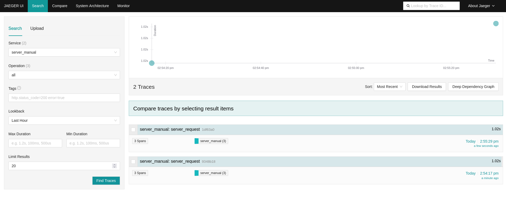
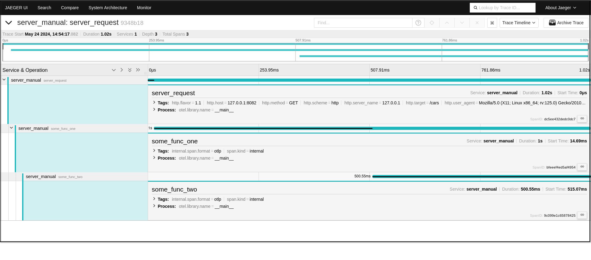
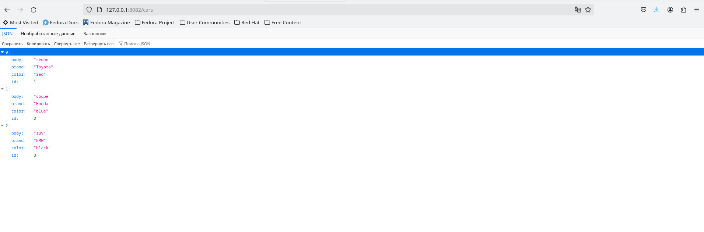
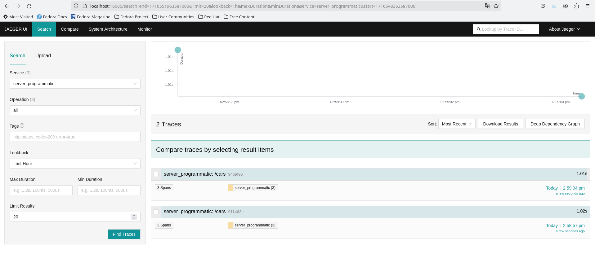
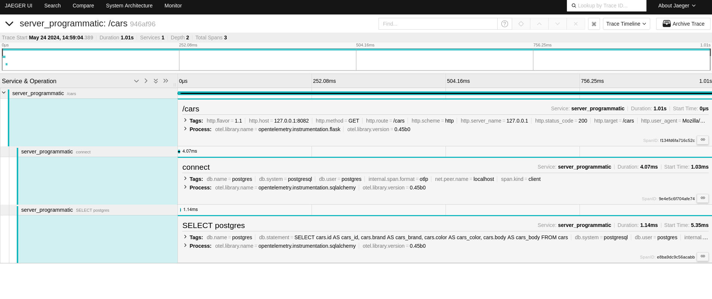
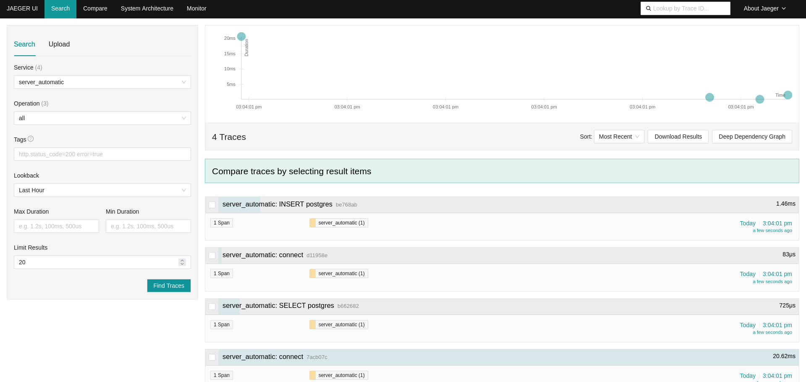

# OpenTelemetry

[Официальный сайт.](https://opentelemetry.io/)  


**OpenTelemetry** - это набор инструментов и стандартов для мониторинга за работой сервисов, а так-же
сбора телеметрических данных, таких как трассировки, метрики и журналы, и управления ими.  
Является проектом Cloud Native Computing Foundation (CNCF), который появился в результате слияния 
двух предыдущих проектов, **OpenTracing** и **OpenCensus**. 

Системы для анализа и визуализации данных:
 * **Prometheus**: Для метрик.
 * **Grafana**: Для визуализации метрик и трейсов.
 * **Jaeger**: Для трейсинга распределённых систем.
 * **Zipkin**: Альтернативный инструмент для трейсинга.
 * **Elasticsearch/Kibana**: Для логирования и анализа логов.
 * **Datadog**: Полный пакет для мониторинга и логирования.
 * **New Relic**: Инструмент для мониторинга производительности приложений.
 * **Splunk**: Для логирования и анализа данных.

# Способы запуска
В примере показаны три сценария запуска:
 * Ручная интеграция
 * Использование библиотек интеграции
 * Автоинструментирование

В примерах будет использоваться Jaeger для сбора, хранения и вывода трейсов приложения на экран
и простое приложение с Flask  
## Установка и запуск Jaeger
### Запуск бинарного файла Jaeger
Скачиваем с [официального сайта.](https://www.jaegertracing.io/download/)  

Пример для Linux с актуальной версией jaeger на 24.05.2024.
```bash
wget https://github.com/jaegertracing/jaeger/releases/download/v1.57.0/jaeger-1.57.0-linux-amd64.tar.gz
```
```bash
sudo tar -xzvf jaeger-1.57.0-linux-amd64.tar.gz -C /usr/local/bin/ --strip-components=1
```
```bash
jaeger-all-in-one
```
Компоненты **Jaeger All-in-One**:
 * **Collector**: Принимает трассы от агентов и сохраняет их в бекенд-хранилище.
 * **Query Service**: Обеспечивает API для поиска и отображения трасс.
 * **Agent**: Локальный агент, который собирает и отправляет трассы в коллектор.
 * **UI**: Веб-интерфейс для просмотра и анализа трасс.
Проверить можно по адресу http://localhost:16686
### Запуск Docker контейнера Jaeger
На [официальном сайте](https://www.jaegertracing.io/download/) есть Docker images,
для примера так же используем Docker images с Jaeger All-in-One, для этого выполним команду 
```bash
docker run -d --name jaeger \
  -e COLLECTOR_OTLP_ENABLED=true \
  -p 5775:5775/udp \
  -p 6831:6831/udp \
  -p 6832:6832/udp \
  -p 5778:5778 \
  -p 16686:16686 \
  -p 14268:14268 \
  -p 14250:14250 \
  -p 4317:4317 \
  jaegertracing/all-in-one

```
Проверить можно по адресу http://localhost:16686

## Ручная интеграция OpenTelemetry
```python
import time

from flask import Flask, request, jsonify
from opentelemetry.exporter.otlp.proto.grpc.trace_exporter import OTLPSpanExporter
from opentelemetry.instrumentation.wsgi import collect_request_attributes
from opentelemetry.propagate import extract
from opentelemetry.sdk.resources import Resource
from opentelemetry.sdk.trace import TracerProvider
from opentelemetry.sdk.trace.export import BatchSpanProcessor
from opentelemetry.trace import (
    SpanKind,
    get_tracer_provider,
    set_tracer_provider,
)

from db import get_db, Car

app = Flask(__name__)

# Создаем ресурс с атрибутом 'service.name'
resource = Resource(attributes={
    'service.name': 'server_manual'
})
# Устанавливаем TracerProvider с созданным ресурсом
set_tracer_provider(TracerProvider(resource=resource))
# Получаем экземпляр трассировщика (tracer)
tracer = get_tracer_provider().get_tracer(__name__)
# Добавляем BatchSpanProcessor для отправки трассировок с использованием OTLPSpanExporter
get_tracer_provider().add_span_processor(
    BatchSpanProcessor(OTLPSpanExporter())
)

@app.route('/cars')
def server_request():
    # Создаем и начинаем новую span для текущего запроса
    with tracer.start_as_current_span(
        'server_request',                        # Имя span
        context=extract(request.headers),       # Извлекаем контекст из заголовков запроса
        kind=SpanKind.SERVER,                   # Указываем, что span типа SERVER
        attributes=collect_request_attributes(request.environ),  # Добавляем атрибуты запроса
    ):
        db = next(get_db())
        cars = db.query(Car).all()
        some_func_one()  # Имитируем стек вызовов
        return jsonify([{"id": car.id, "brand": car.brand, "color": car.color, "body": car.body} for car in cars])


def some_func_one() -> None:
    # Создаем и начинаем новую span для текущего запроса
    with tracer.start_as_current_span("some_func_one"):
        time.sleep(0.5)
        some_func_two()


def some_func_two() -> None:
    # Создаем и начинаем новую span для текущего запроса
    with tracer.start_as_current_span("some_func_two"):
        time.sleep(0.5)


if __name__ == '__main__':
    app.run(port=8082)
```
В этом примере мы вручную создаем span с помощью контекстного менеджера with.  
После запуска этого приложения переходим на http://localhost:8082/server_request.  
Переходим обратно в Jaeger UI http://localhost:16686, обновляем страницу, в выпадающем списке должен появиться
сервис 'my_app', выбираем его, кликаем Find Trace, должны отобразиться трейсы,
можно вернуться на http://localhost:8082/server_request, пару раз обновить и посмотреть результат на Jaeger UI http://localhost:16686.  

  

Для подробной информации можно кликнуть на трейс.
  
Слева виден стек вызовов.  

http://localhost:8082/server_request выглядит примерно так.
  

## Использование библиотек OpenTelemetry для интеграции 
```python
import time

from flask import Flask, jsonify
from opentelemetry.exporter.otlp.proto.grpc.trace_exporter import OTLPSpanExporter
from opentelemetry.instrumentation.flask import FlaskInstrumentor
from opentelemetry.instrumentation.sqlalchemy import SQLAlchemyInstrumentor
from opentelemetry.sdk.resources import Resource
from opentelemetry.sdk.trace import TracerProvider
from opentelemetry.sdk.trace.export import BatchSpanProcessor
from opentelemetry.trace import get_tracer_provider, set_tracer_provider

from db import get_db, Car, engine

# Создаем ресурс с атрибутом 'service.name'
resource = Resource(attributes={
    "service.name": 'server_programmatic'
})
# Устанавливаем TracerProvider с созданным ресурсом
set_tracer_provider(TracerProvider(resource=resource))
# Добавляем BatchSpanProcessor для отправки трассировок с использованием OTLPSpanExporter
get_tracer_provider().add_span_processor(
    BatchSpanProcessor(OTLPSpanExporter())
)

app = Flask(__name__)
# Инструментируем Flask приложение для автоматического сбора трассировок
FlaskInstrumentor().instrument_app(app, excluded_urls=None)  # excluded_urls исключает указанные URL
# Инструментируем SQLAlchemy приложение для автоматического сбора трассировок
SQLAlchemyInstrumentor().instrument(engine=engine)

@app.route("/cars")
def server_request():
    db = next(get_db())
    cars = db.query(Car).all()
    some_func_one()  # Имитируем стек вызовов
    return jsonify([{"id": car.id, "brand": car.brand, "color": car.color, "body": car.body} for car in cars])


def some_func_one() -> None:
    time.sleep(0.5)
    some_func_two()


def some_func_two() -> None:
    time.sleep(0.5)


if __name__ == "__main__":
    app.run(port=8082)
```
В этом примере мы инструментируем Flask и SQLAlchemy приложение для автоматического 
сбора трассировок.  
Результат можно проверить в Jaeger UI http://localhost:16686 выбрав сервис 'server_programmatic'.
  
Trace
  
Появились новые span которые OpenTelemetry передает с помощью своих инструментов.  
Функций some_func_one и some_func_two нет, так как убрано создание span через контекстный менеджер.

## Автоинструментирование OpenTelemetry
```python
import time
from flask import Flask, jsonify
from db import get_db, Car

# Создаем экземпляр Flask приложения
app = Flask(__name__)

# Определяем маршрут (endpoint) для обработки запросов на '/server_request'
@app.route("/cars")
def server_request():
    db = next(get_db())
    cars = db.query(Car).all()
    some_func_one()  # Имитируем стек вызовов
    return jsonify([{"id": car.id, "brand": car.brand, "color": car.color, "body": car.body} for car in cars])


def some_func_one() -> None:
    time.sleep(0.5)
    some_func_two()


def some_func_two() -> None:
    time.sleep(0.5)

if __name__ == "__main__":
    app.run(port=8082)
```
Перед запуском этого скрипта выполните следующие действия
```bash
pip install opentelemetry-distro opentelemetry-exporter-otlp
opentelemetry-bootstrap -a install
```
В opentelemetry-distro пакете устанавливаются API, SDK и инструменты opentelemetry-bootstrap и opentelemetry-instrument.

Команда **opentelemetry-bootstrap -a install** считывает список пакетов, установленных в вашей активной site-packages папке,
и устанавливает соответствующие библиотеки инструментирования для этих пакетов, если применимо.
Например, если вы уже установили flask пакет, запуск opentelemetry-bootstrap -a install произведет
установку opentelemetry-instrumentation-flask за вас.  

Далее
```bash
opentelemetry-instrument \
    --traces_exporter otlp \
    --metrics_exporter none \
    --service_name server_automatic \
    --exporter_otlp_endpoint http://localhost:4317 \
    python server_automatic.py
```
Либо
```bash
OTEL_SERVICE_NAME=server_automatic \
OTEL_TRACES_EXPORTER=otlp \
OTEL_METRICS_EXPORTER=none \
OTEL_EXPORTER_OTLP_TRACES_ENDPOINT=http://localhost:4317
opentelemetry-instrument \
    python server_automatic.py
```
Результат можно проверить в Jaeger UI http://localhost:16686 выбрав сервис 'server_automatic'.
  
opentelemetry-bootstrap считала список пакетов и автоматически подключила необходимые инструменты.